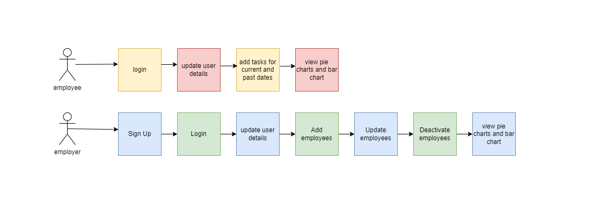

# CHELLO
<div align="center">
    
</div><br>
CHELLO is an employee monitoring and managing web application. It contains minimalistic yet effective features aiming to be the only employee management tool you will ever need.<br><br>


## Table of Contents
1. [Installation](#installation)
2. [Getting Started](#getting-started)
3. [Block Diagram](#block-diagram)
4. [Technolgoies](#technologies)
5. [Database](#database)
6. [Result](#result)
7. [Future Scope](#future-scope)
8. [Acknowledgement](#acknowledgement)

# Installation 

1. Fork this repository or download the code zip file.<br><br>
2. Clone the repository if forked.
```bash
git clone https://github.com/<username>/chello.git
```
3. Open your local server setup, we prefer [WAMP](https://sourceforge.net/projects/wampserver/).<br><br>

4. Navigate to below destination and drop the folder inside directory for exposing the website to port.
(Find relevant folder of your local server (if not WAMP))
```
C://wamp64/www/chello
```

6. Visit `http://localhost/chello` in your browser, to view the website.

7. Navigate to `phpMyAdmin` and import the `emp.sql` file from the `database-dump` folder.

9. Change necessary database details in `partials/db.php`.

8. Refresh `http://localhost/chello` in your browser.

# Getting Started

Please watch the [demo video](https://drive.google.com/file/d/1tm3YAWtfOGAsXhb08O-9SiKAqj7QMBX4/view?usp=sharing), to understand the complete functionality of the website.<br><br>
Currently there are two users in the website.
- employee [ user  ]
- employer [ admin ]  

The system implements **RBAC**.<br><br>
Here are the list of actions that can be performed by the **employee**.  
1. The employee can **only** be added by an employer. When an employer adds an employee they get an **temporary password** that they can later mail to the invited to employee so they can onboard CHELLO successfully.
2. The employee can **login**.   
3. The employee can **update certain user details** including changing passwords **except mail ID**.  
4. The employee can **add tasks** for **past dates and current date** not future.
5. The employee can **view** the **pie charts and stacked bar chart** of their tasks productivity.
6. The employee can't login after being **deactivated** by employer.  

Other actions are **restricted**, such as viewing other employees user details and admin-only web pages.<br><br>

Here are the list of actions that can be performed by the **employer**.  
1. The employer can **Sign Up** into CHELLO
2. The employer can **login**.   
3. The employer can **update certain user details** including changing passwords **except mail ID**.  
4. The employer can **add employees**.  
5. The employer can **update employee details**
6. The employer can **view** the **pie charts and stacked bar chart** of the respective employee.
7. The employer can **deactivate** an employee.

Multiple employers and employees can exist in the system simultaneously.

# Block Diagram  

<div>

</div>

# Technologies

- Frontend - **HTML, CSS, Javascript, Bootstrap, Chart js, Moment js** 
- Backend  - **PHP**
- Database - **MySQL**

# Database
All credentials are hashed and securedly stored, for information on schema and database architecture please view `emp.sql` file in `database-dump` folder. 

# Result
Intended Goals were fully met.

# Future Scope

- Datetime filter can be implemented.
- UI can be improved.
- Website should be made responsive
